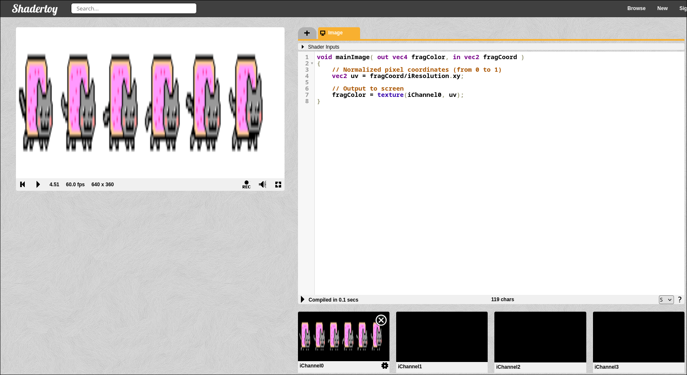

## Hit 3 - Copiar iChannel0 a la salida

**No tenemos cámara web en este momento por lo que utilizamos una textura de shadertoy**

```glsl
void mainImage( out vec4 fragColor, in vec2 fragCoord )
{
    // Normalized pixel coordinates (from 0 to 1)
    vec2 uv = fragCoord/iResolution.xy;

    // Output to screen
    fragColor = texture(iChannel0, uv);
}
```


