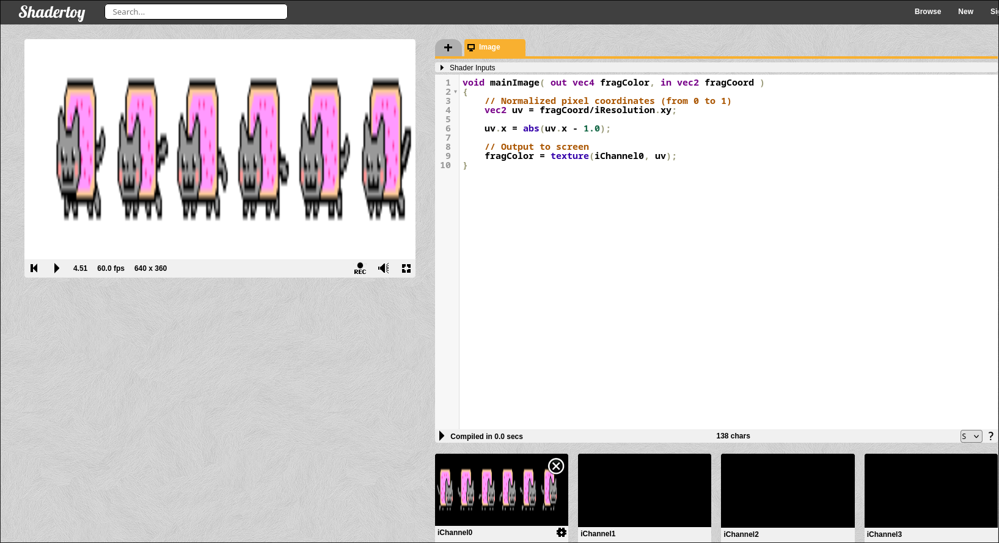

## Hit 4 - Efectos Flip


```glsl
void mainImage( out vec4 fragColor, in vec2 fragCoord )
{
    // Normalized pixel coordinates (from 0 to 1)
    vec2 uv = fragCoord/iResolution.xy;

    uv.x = abs(uv.x - 1.0);

    // Output to screen
    fragColor = texture(iChannel0, uv);
}
```


