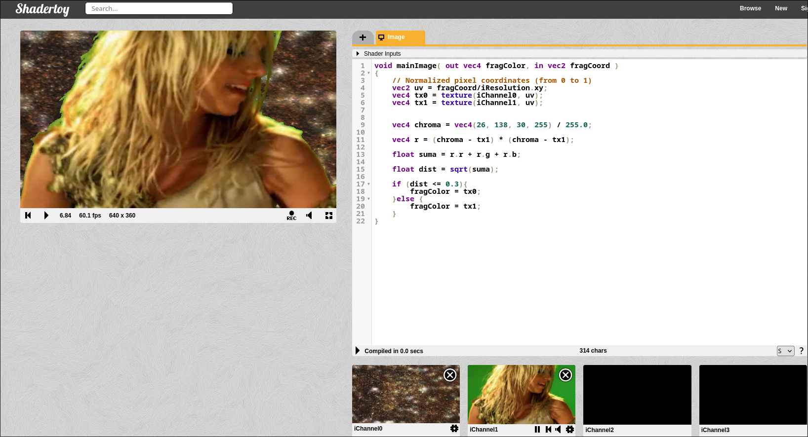
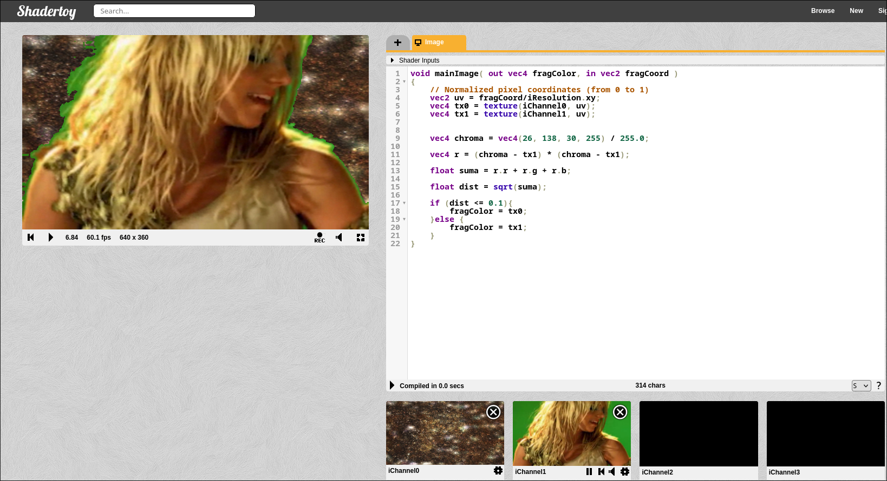
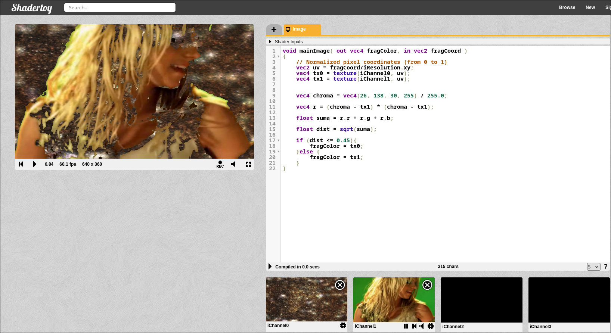

## Hit 5 - Chroma rgb


```glsl
void mainImage( out vec4 fragColor, in vec2 fragCoord )
{
    // Normalized pixel coordinates (from 0 to 1)
    vec2 uv = fragCoord/iResolution.xy;
    vec4 tx0 = texture(iChannel0, uv);
    vec4 tx1 = texture(iChannel1, uv);


    vec4 chroma = vec4(26, 138, 30, 255) / 255.0;

    vec4 r = (chroma - tx1) * (chroma - tx1);

    float suma = r.r + r.g + r.b;

    float dist = sqrt(suma);

    if (dist <= 0.3){
        fragColor = tx0;
    }else {
        fragColor = tx1;
    }
}
```
### Threshold = 0.3



### Threshold = 0.1



### Threshold = 0.45

