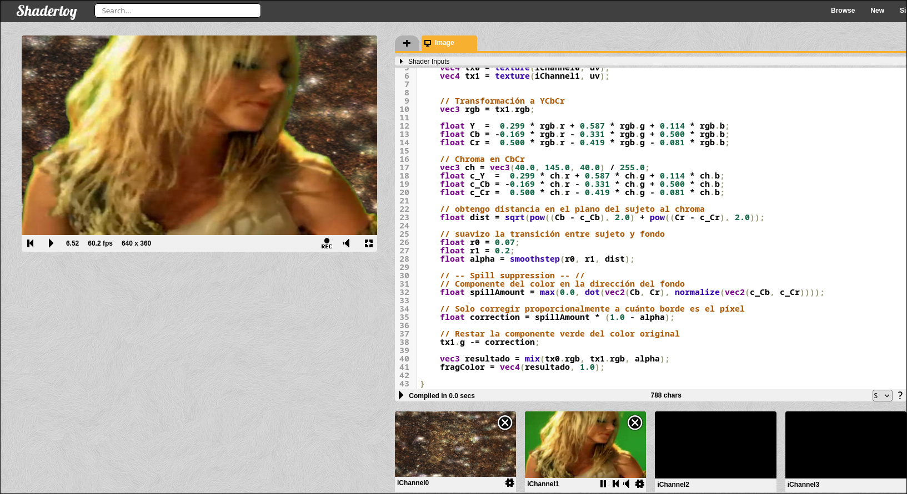

## Hit 5 - Chroma YCbCr


```glsl
void mainImage( out vec4 fragColor, in vec2 fragCoord )
{
    // Normalized pixel coordinates (from 0 to 1)
    vec2 uv = fragCoord/iResolution.xy;
    vec4 tx0 = texture(iChannel0, uv);
    vec4 tx1 = texture(iChannel1, uv);


    // Transformación a YCbCr
    vec3 rgb = tx1.rgb;

    float Y  =  0.299 * rgb.r + 0.587 * rgb.g + 0.114 * rgb.b;
    float Cb = -0.169 * rgb.r - 0.331 * rgb.g + 0.500 * rgb.b;
    float Cr =  0.500 * rgb.r - 0.419 * rgb.g - 0.081 * rgb.b;

    // Chroma en CbCr
    vec3 ch = vec3(40.0, 145.0, 40.0) / 255.0;
    float c_Y  =  0.299 * ch.r + 0.587 * ch.g + 0.114 * ch.b;
    float c_Cb = -0.169 * ch.r - 0.331 * ch.g + 0.500 * ch.b;
    float c_Cr =  0.500 * ch.r - 0.419 * ch.g - 0.081 * ch.b;   

    // obtengo distancia en el plano del sujeto al chroma
    float dist = sqrt(pow((Cb - c_Cb), 2.0) + pow((Cr - c_Cr), 2.0));

    // suavizo la transición entre sujeto y fondo
    float r0 = 0.07;
    float r1 = 0.2;
    float alpha = smoothstep(r0, r1, dist);

    // -- Spill suppression -- //
    // Componente del color en la dirección del fondo
    float spillAmount = max(0.0, dot(vec2(Cb, Cr), normalize(vec2(c_Cb, c_Cr))));

    // Solo corregir proporcionalmente a cuánto borde es el píxel
    float correction = spillAmount * (1.0 - alpha);

    // Restar la componente verde del color original
    tx1.g -= correction;

    vec3 resultado = mix(tx0.rgb, tx1.rgb, alpha);
    fragColor = vec4(resultado, 1.0);
}
```

### Chroma en YCbCr



---
---

## Por qué YCbCr es superior a RGB para chroma key

### El problema central

El fondo de chroma no es un color exacto. Es una superficie física iluminada — tiene sombras, gradientes, reflexiones, variaciones de temperatura de color. En la práctica el "verde" del fondo es una nube de puntos, no un punto único.

El criterio de calidad de un espacio de color para chroma key es: **qué tan compacta es esa nube**.

---

### Cómo se ve la nube en RGB

En RGB, el brillo y el color están mezclados en los tres canales simultáneamente. Una zona iluminada del fondo tiene valores altos en G y moderados en R y B. Una zona en sombra tiene todos los valores bajos. Una zona con reflexión tiene los tres canales afectados de forma diferente.

El resultado es una nube **elongada en la diagonal del cubo RGB**, estirada desde el negro hacia el verde brillante. No es compacta — ocupa un volumen significativo del espacio.

Para umbralizar esa nube hay que definir una región 3D irregular. Cualquier umbral simple corta mal: o incluye píxeles del sujeto que tienen algo de verde, o excluye zonas del fondo en sombra.

---

### Cómo se ve la nube en YCbCr

Al separar Y de Cb-Cr, la variación de brillo se va **completamente a Y**. Una zona iluminada y una en sombra del mismo verde tienen Y muy distintas pero Cb-Cr casi idénticas.

Proyectando al plano Cb-Cr, la nube que antes estaba elongada en 3D ahora está **colapsada a un punto compacto**. Las variaciones de iluminación desaparecen de este plano porque están capturadas por Y, que se ignora.

La distancia euclidiana en Cb-Cr a ese punto compacto es un clasificador eficaz. Un umbral circular en 2D hace lo que un umbral irregular en 3D no podía.

---

### La razón geométrica profunda

RGB mezcla dos cosas conceptualmente distintas: **cuánta luz hay** y **de qué color es esa luz**. Esa mezcla es conveniente para displays (que emiten R, G, B independientemente) pero inconveniente para análisis.

YCbCr los separa. Y responde "cuánta luz". Cb-Cr responde "de qué color". Para chroma key solo importa la segunda pregunta. Al ignorar Y se elimina la fuente principal de variación no deseada.

---

### Consecuencia práctica

| Condición | RGB | YCbCr |
|---|---|---|
| Fondo bien iluminado | funciona | funciona |
| Fondo con sombras | falla (valores bajos en los 3 canales) | funciona (Cb-Cr estable) |
| Fondo con gradiente de luz | falla | funciona |
| Sujeto con ropa verde | falla en ambos casos | falla en ambos casos |
| Bordes con mezcla parcial | transición abrupta | transición suave posible |

El único caso donde YCbCr no ayuda es cuando el sujeto contiene el mismo color que el fondo — ese es un problema de contenido, no de espacio de color. Ningún espacio lo resuelve sin información adicional.
