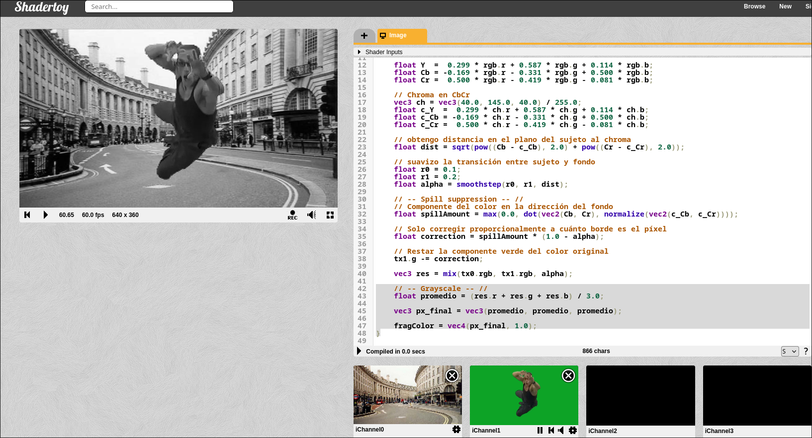
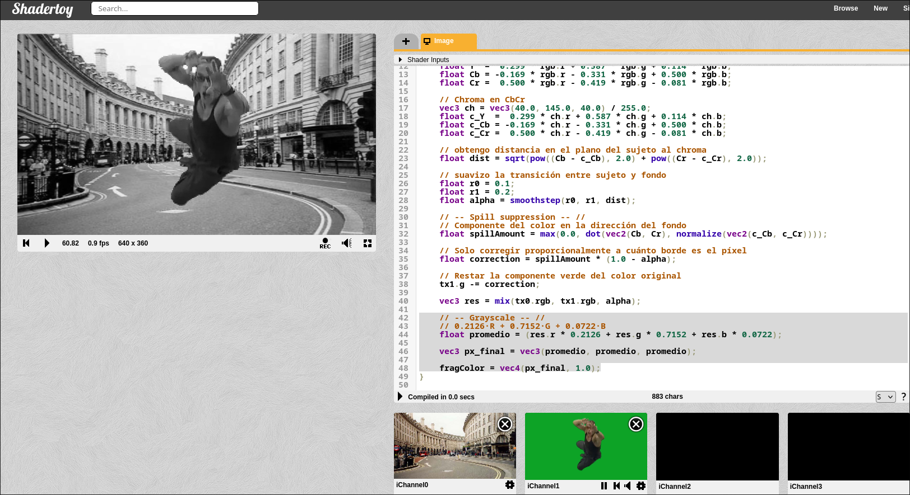
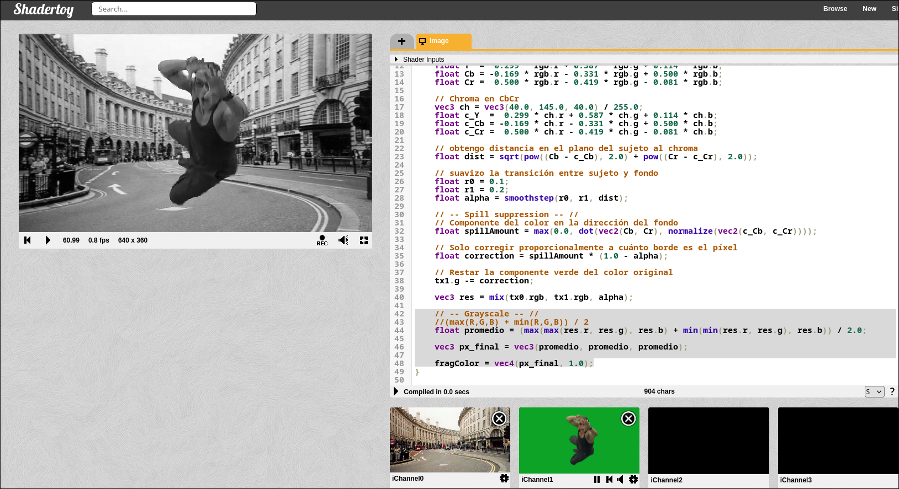
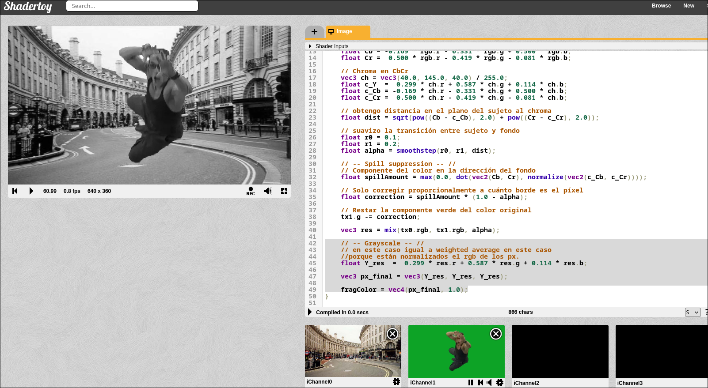
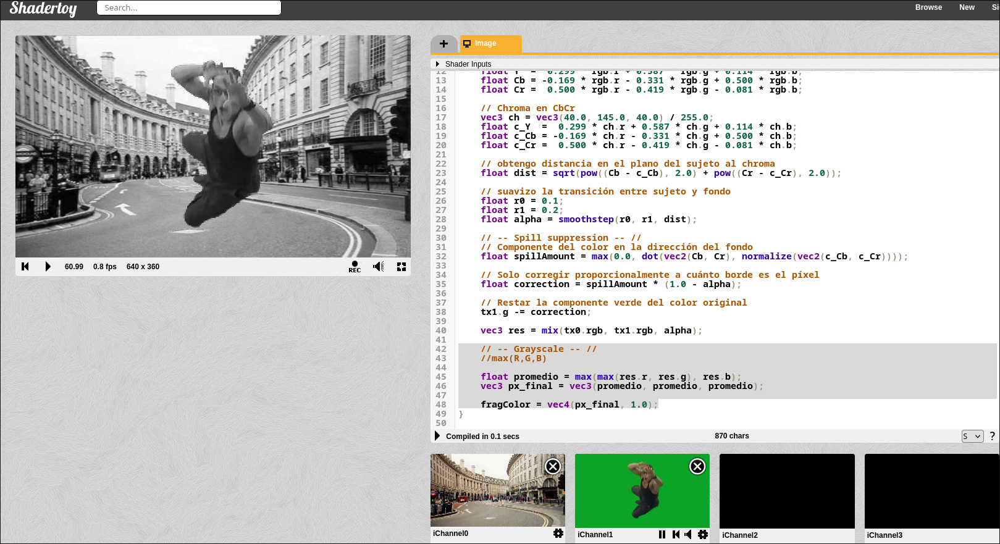

## Conversión a escala de grises en shaders

---

### 1. Promedio simple (Average)

**Concepto:** `(R + G + B) / 3`

Trata los tres canales como igualmente significativos.

**Pros:** Trivial de implementar, sin parámetros.
**Contras:** Ignora completamente la fisiología del sistema visual humano. El ojo no percibe R, G y B con igual sensibilidad. Produce imágenes que se sienten "incorrectas" perceptualmente, especialmente en rojos y verdes saturados.




```glsl
    // -- Grayscale -- //
    float promedio = (res.r + res.g + res.b) / 3.0;

    vec3 px_final = vec3(promedio, promedio, promedio);

    fragColor = vec4(px_final, 1.0);
```

---

### 2. Luminancia perceptual (Weighted average)

**Concepto:** `0.299·R + 0.587·G + 0.114·B` (BT.601) o `0.2126·R + 0.7152·G + 0.0722·B` (BT.709)

Los pesos reflejan la sensibilidad diferencial de los fotorreceptores cónicos humanos. El verde domina porque la curva de sensibilidad del ojo tiene su pico en ~555 nm. BT.601 es para espacio de color SD (sRGB legacy), BT.709 es para HD/sRGB moderno.

**Pros:** Preserva el brillo percibido. Es el estándar de la industria. La imagen resultante mantiene el contraste visual que el ojo original detectaría.
**Contras:** Opera en espacio lineal o gamma dependiendo del pipeline. Si la textura está en sRGB (gamma ~2.2) y no se lineariza antes, los pesos son técnicamente incorrectos aunque visualmente aceptables.



```glsl
    // -- Grayscale -- //
    // 0.2126·R + 0.7152·G + 0.0722·B
    float promedio = (res.r * 0.2126 + res.g * 0.7152 + res.b * 0.0722);

    vec3 px_final = vec3(promedio, promedio, promedio);

    fragColor = vec4(px_final, 1.0);
```

---

### 3. Luminosidad HSL (Lightness)

**Concepto:** `(max(R,G,B) + min(R,G,B)) / 2`

Extraído del modelo de color HSL, representa el punto medio entre el canal más brillante y el más oscuro.

**Pros:** Bajo costo computacional, captura el rango dinámico del píxel.
**Contras:** Ignora la distribución interna de energía entre canales. Aplana diferencias perceptuales entre colores de igual lightness pero distinto hue/saturation. Produce halos o pérdida de detalle en regiones con saturación alta.



```glsl
    // -- Grayscale -- //
    //(max(R,G,B) + min(R,G,B)) / 2
    float promedio = (max(max(res.r, res.g), res.b) + min(min(res.r, res.g), res.b)) / 2.0;

    vec3 px_final = vec3(promedio, promedio, promedio);

    fragColor = vec4(px_final, 1.0);
```

---

### 4. Luma del canal Y (extracción directa)

**Concepto:** Convertir RGB → YCbCr o YUV y extraer Y.

Y en YCbCr BT.709: `16 + 65.481·R + 128.553·G + 24.966·B` (rango [16,235] en 8-bit), o en forma normalizada equivalente a la luminancia perceptual.

**Pros:** Coherente con pipelines de video y compresión. Si el contenido viene de video, esta conversión es la más fiel a la intención original.
**Contras:** En Shadertoy, donde generalmente se trabaja con valores [0,1], es equivalente a la luminancia perceptual pero con overhead conceptual innecesario salvo que el pipeline lo requiera.




```glsl
    // -- Grayscale -- //
    // en este caso igual a weighted average en este caso
    //porque están normalizados el rgb de los px.

    float Y_res  =  0.299 * res.r + 0.587 * res.g + 0.114 * res.b;

    vec3 px_final = vec3(Y_res, Y_res, Y_res);

    fragColor = vec4(px_final, 1.0);
```

---

### 5. Valor HSV (Value)

**Concepto:** `max(R, G, B)`

El canal V del espacio HSV.

**Pros:** Preserva el brillo máximo del píxel. Útil para efectos donde interesa el punto de mayor energía.
**Contras:** Ignora completamente dos tercios de la información cromática. Produce imágenes con contraste artificialmente elevado y pérdida severa en sombras.



```glsl
    // -- Grayscale -- //
    //max(R,G,B)

    float promedio = max(max(res.r, res.g), res.b);    
    vec3 px_final = vec3(promedio, promedio, promedio);

    fragColor = vec4(px_final, 1.0);
```

---

### 6. Linearización + luminancia (pipeline físicamente correcto)

**Concepto:** Aplicar gamma inversa (sRGB → lineal), calcular luminancia perceptual, opcionalmente re-aplicar gamma para display.

Fórmula de linearización sRGB:
- Si `c ≤ 0.04045`: `c / 12.92`
- Si `c > 0.04045`: `((c + 0.055) / 1.055)^2.4`

Luego aplicar BT.709, luego re-gamma si necesario.

**Pros:** Físicamente correcto. La luminancia perceptual con los pesos BT.709 asume espacio lineal. Sin este paso, los pesos son aproximaciones. Crítico en trabajo con HDR, iluminación o cuando la precisión colorimétrica importa.
**Contras:** Más caro computacionalmente (pow). En Shadertoy con texturas sRGB, la diferencia visual suele ser sutil pero existe. Ignorable en prototipos, no ignorable en producción.


```glsl
```
---

## Cuál es el mejor

**Luminancia perceptual BT.709 con linearización previa** cuando la textura está en sRGB y se requiere corrección.

**Luminancia perceptual BT.709 directa** (`dot(color.rgb, vec3(0.2126, 0.7152, 0.0722))`) cuando se trabaja en el contexto habitual de Shadertoy sin exigencia de precisión colorimétrica máxima.

La justificación es que este método es el único que modela el sistema visual humano correctamente, está estandarizado internacionalmente (ITU-R BT.709), y el costo computacional es mínimo (un `dot product`). Los demás métodos son aproximaciones que sacrifican fidelidad perceptual por simplicidad o sirven propósitos específicos no relacionados con reproducción fiel de luminosidad.
